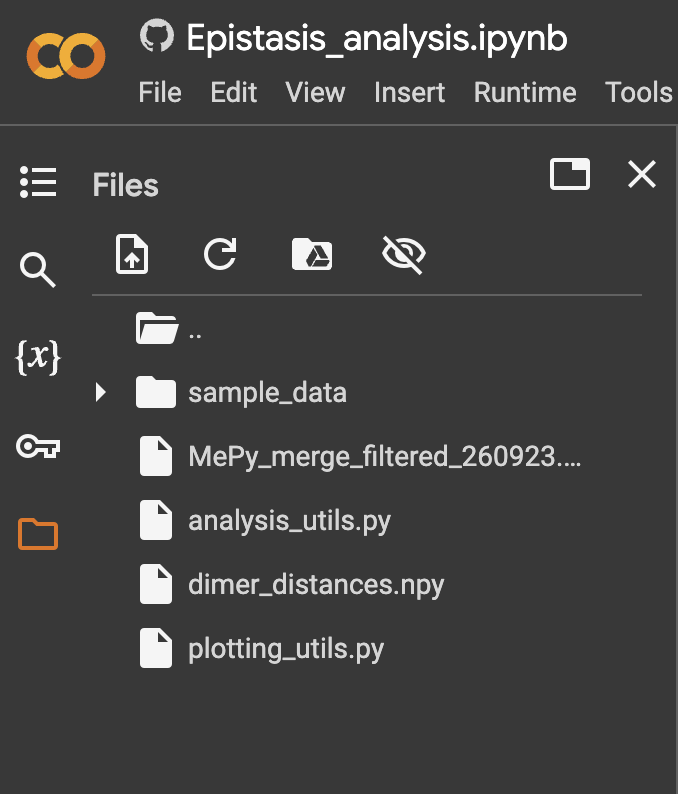

# Structural epistasis analysis

Scripts to preprocess deep mutational scanning (DMS) data. The data are analysed for combinability of mutations and the effect of epistasis.

If a residue distance matrix is available, structural epistasis graphs can be generated that visualise combinability hotspots and their centrality in the protein.

The used reference wildtype for the IRED that is also used in all scripts is:
```ruby
reference = "MRDTDVTVLGLGLMGQALAGAFLKDGHATTVWNRSEGKAGQLAEQGAVLASSARDAAEASPLVVVCVSDHAAVRAVLDPLGDVLAGRVLVNLTSGTSEQARATAEWAAERGITYLDGAIMAIPQVVGTADAFLLYSGPEAAYEAHEPTLRSLGAGTTYLGADHGLSSLYDVALLGIMWGTLNSFLHGAALLGTAKVEATTFAPFANRWIEAVTGFVSAYAGQVDQGAYPALDATIDTHVATVDHLIHESEAAGVNTELPRLVRTLADRALAGGQGGLGYAAMIEQFRSPS*"
```

## Installation

### Colab

The easiest way to run the scripts is via Google Colab. The Jupyter notebook Epistasis_analysis.ipynb can directly be opened on Colab by pressing the following Open in Colab button:

[](https://colab.research.google.com/github/fweberling/epistasis/blob/main/Epistasis_analysis.ipynb)

After having opened the notebook in Colab, the python scripts `analysis_utils.py` and `plotting_utils.py` need to be uploaded. These scripts contain the core functions for the analyses and plots to be carried out. Also, the csv file `MePy_merge_filtered_260923.csv` containing the DMS data along side the distance matrix npy file `min_dimer_distances.npy` must be uploaded as shown by the following screenshot:



### Terminal

The code can also be run via terminal. For that, use `main.py`


## License 

[MIT](https://choosealicense.com/licenses/mit/)